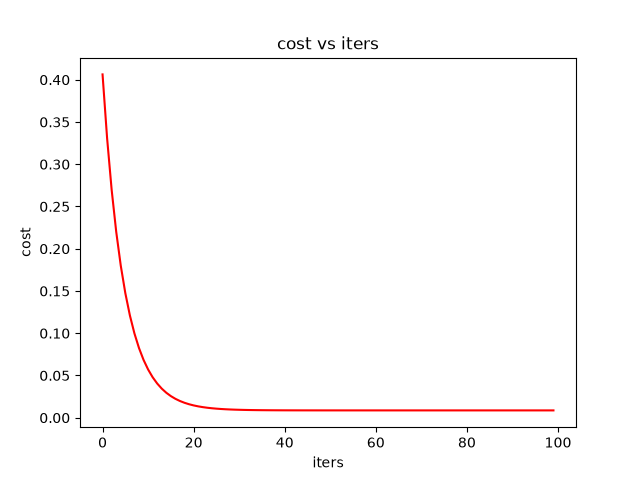
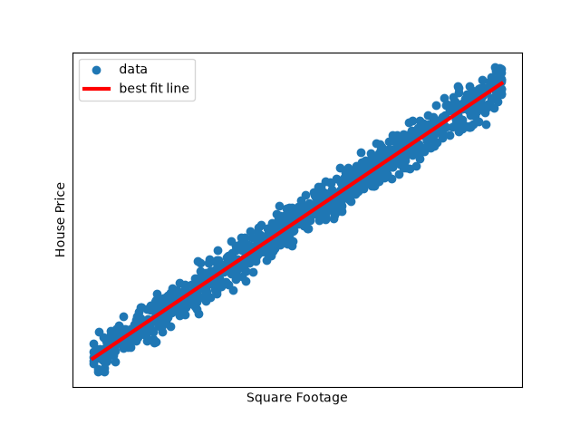

Single Variable Linear Regression From Scratch

A simple implementation of Single Variable Linear Regression using Python, NumPy, Pandas, and Matplotlib.

This project implements Linear Regression manually using Gradient Descent without using Scikit-learn.

Features

- Single Variable Linear Regression
- Cost Function
- Gradient Descent
- Feature Scaling
- Model Parameter Optimization
- Data Visualization

Dataset

The model uses a house price dataset from kaggle with:

- Square Footage

The target variable is:

- House Price

Algorithm

The model learns the parameters using Gradient Descent.

The cost function used is:

J(θ) = 1/(2m) Σ(hθ(x) - y)²

At each iteration, Gradient Descent updates the model parameters in order to minimize the cost.

Implementation

The implementation includes:

1. Loading the dataset
2. Feature scaling
3. Adding the bias term
4. Initializing the parameters
5. Calculating the prediction error
6. Updating the parameters using Gradient Descent
7. Calculating the cost at each iteration
8. Visualizing the best-fit line

Results

The model learns a best-fit line for the relationship between Square Footage and House Price.

Technologies

- Python
- NumPy
- Pandas
- Matplotlib

Note:
Scikit-learn was not used.
Note

Scikit-learn was not used.
